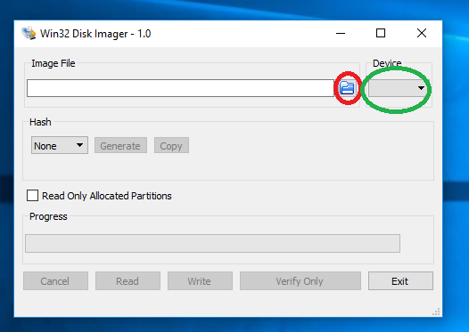
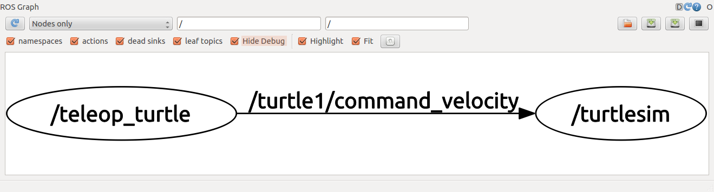

# ROS (Robotics Operating System) install on raspberry pi
### Hardware requirement
- Raspberry pi 2/3
- SD card 16 GB to 32 GB
- Card reader
- HDMI monitor (optional)
- Keyboard (optional)
- Mouse (optional)
     
## Download
 **Download ROS Image (Ubuntu mate)**
- https://downloads.ubiquityrobotics.com/pi.html
- It take some minutes about 1 GB file. When download completed Unzip ROS image into a folder 

 **Download Win32DiskImager**
- https://drive.google.com/file/d/1Bs2cClNa-LKqeoK8Kmcm-DWhFKsQw2dj/view?usp=sharing 
- when download complete then install Win32DiskImager
- Open Win32DiskImager 
## Image write into SD Card
- Inser SDCard into your pc
- Open Win32DiskImager

- Set image path using red circle button
- Select SDcard using green circle
- Everything is ok then click write
- It will takes some minutes

## Start ROS operating system
- Insert SDcard into Raspberry pi
- Power up
- Psername: **ubuntu**
- Password: **ubuntu**
## Test ROS
- Press **Ctrl+Alt+T** for open terminal
- **Open terminal** 
#    
               
    $ rostopic list
    Output
    /battery_state
    /cmd_vel
    /diagnostics
    /joint_states
    /joy
    /left_error
    /motor_node/parameter_descriptions
    /motor_node/parameter_updates
    /right_error
    /rosout
    /rosout_agg
    /statistics
    /tf
    /tf2_web_republisher/cancel
    /tf2_web_republisher/feedback
    /tf2_web_republisher/goal
    /tf2_web_republisher/result
    /tf2_web_republisher/status
    /tf_static
    
    
### Thanks install Completed    

# Creating a catkin Package

You have already **catkin_ws** this Workspace

    $ ls
    output 
    catkin_ws  Desktop  Documents  Downloads  Music
## Creating a catkin Package
    
    $ cd catkin_ws/src     
    $ catkin_create_pkg beginner_tutorials std_msgs rospy roscpp
    $ cd
    
## Building a catkin workspace and sourcing the setup file    
    
build the packages in the catkin workspace
    
    $ cd catkin_ws/
    $ catkin_make
    
add the workspace to your ROS environment you need to source the generated setup file    

    $ . ~/catkin_ws/devel/setup.bash
    $ rospack depends1 beginner_tutorials 
    
**Output**    
    
    roscpp
    rospy
    std_msgs

**Again**

    $ roscd beginner_tutorials
    $ cat package.xml
    
**Output**

    <package format="2">
    ...
      <buildtool_depend>catkin</buildtool_depend>
      <build_depend>roscpp</build_depend>
      <build_depend>rospy</build_depend>
      <build_depend>std_msgs</build_depend>
    ...
    </package>
                
## Indirect dependencies
    
In many cases, a dependency will also have its own dependencies. For instance, rospy has other dependencies

    $ rospack depends1 rospy
    
**Output**
    
    genpy
    roscpp
    rosgraph
    rosgraph_msgs
    roslib
    std_msgs        
                        
A package can have quite a few indirect dependencies. Luckily rospack can recursively determine all nested dependencies.             

    $ rospack depends beginner_tutorials
**Output**

    cpp_common
    rostime
    roscpp_traits
    roscpp_serialization
    catkin
    genmsg
    genpy
    message_runtime
    gencpp
    geneus
    gennodejs
    genlisp
    message_generation
    rosbuild
    rosconsole
    std_msgs
    rosgraph_msgs
    xmlrpcpp
    roscpp
    rosgraph
    ros_environment
    rospack
    roslib
    rospy
## Customization pakage.xml

    <?xml version="1.0"?>
    <package format="2">
    <name>beginner_tutorials</name>
    <version>0.1.0</version>
    <description>The beginner_tutorials package</description>
    <maintainer email="borhan.u.cse@gmail.com">Borhan</maintainer>
    <license>BSD</license>
    <url type="website">http://wiki.ros.org/beginner_tutorials</url>
    <author email="you@yourdomain.tld">Jane Doe</author>   
    <buildtool_depend>catkin</buildtool_depend>   
    <build_depend>roscpp</build_depend>
    <build_depend>rospy</build_depend>
    <build_depend>std_msgs</build_depend>   
    <exec_depend>roscpp</exec_depend>
    <exec_depend>rospy</exec_depend>
    <exec_depend>std_msgs</exec_depend>   
    </package>               
   
**Reference**
- http://wiki.ros.org/ROS/Tutorials/CreatingPackage

## Building ROS Package

    $ source /opt/ros/kinetic/setup.bash
#### build and instal
Thre are many way to build and install. i listed two way
###### By direct 
   
    $ cd catkin_ws/
    $ catkin_make
    $ catkin_make install
###### By path src folder location (it can be my_src)
    $ cd catkin_ws/
    $ catkin_make --source src
    $ catkin_make install --source my_src

http://wiki.ros.org/ROS/Tutorials/BuildingPackages   

# Understanding ROS Nodes

#### Install lighweight simulator
    Replace '<distro>' with the name of your ROS distribution (e.g. indigo, jade, kinetic)
    # sudo apt-get install ros-<distro>-ros-tutorials
    $ sudo apt-get install ros-kinetic-ros-tutorials    
 ##### run roscore
 
    $ roscore    
    output
    ... logging to /home/ubuntu/.ros/log/1bd0df36-e7d1-11e8-9688-210d8ebfdfb1/roslaunch-ubiquityrobot-2178.log
    Checking log directory for disk usage. This may take awhile.
    Press Ctrl-C to interrupt
    Done checking log file disk usage. Usage is <1GB.
    
    started roslaunch server http://ubiquityrobot.local:34725/
    ros_comm version 1.12.13
    
    
    SUMMARY
    ========
    
    PARAMETERS
     * /rosdistro: kinetic
     * /rosversion: 1.12.13
    
    NODES
 ### Goto  
 http://ubiquityrobot.local:11311/

## Using rosnode
    $ rosnode list
    output 
    /rosout
    $ rosnode info /rosout 
**output**

    --------------------------------------------------------------------------------
    
    Node [/rosout]
    Publications:
     * /rosout_agg [rosgraph_msgs/Log]
    
    Subscriptions:
     * /rosout [rosgraph_msgs/Log]
    
    Services:
     * /rosout/get_loggers
     * /rosout/set_logger_level
    
    
    contacting node http://ubiquityrobot.local:43447/ ...
    Pid: 948
    Connections:
     * topic: /rosout
        * to: /joy_node (http://ubiquityrobot.local:39817/)
        * direction: inbound
        * transport: TCPROS
     * topic: /rosout
        * to: /teleop_twist_joy (http://ubiquityrobot.local:41661/)
        * direction: inbound
        * transport: TCPROS

## Using rosrun
    $ rosrun turtlesim turtlesim_node
    
**Open a window like this**

      

#### Ping rosnode  

    $ rosnode list
    
    OUTPUT
    /joint_state_publisher
    /joy_node
    /motor_node
    /myturtle
    /robot_state_publisher
    /rosbridge_ws/rosapi
    /rosbridge_ws/rosbridge_websocket
    /rosbridge_wss/rosapi
    /rosbridge_wss/rosbridge_websocket
    /rosout
    /teleop_twist_joy
    /tf2_web_republisher
    /turtlesim
    
    $ rosrun turtlesim turtlesim_node
**open another terminal**

    $ rosnode ping turtlesim    
    OUTPUT    
    xmlrpc reply from http://ubiquityrobot.local:41327/     time=3.234863ms
    xmlrpc reply from http://ubiquityrobot.local:41327/     time=3.123999ms
    xmlrpc reply from http://ubiquityrobot.local:41327/     time=3.172874ms
    xmlrpc reply from http://ubiquityrobot.local:41327/     time=3.125906ms
    xmlrpc reply from http://ubiquityrobot.local:41327/     time=3.174067ms
    
#### change node name 
    $ rosrun turtlesim turtlesim_node __name:=my_turtle    
    
# Understanding ROS Topics

### Run roscope 
    $ roscore
### Run turtlesim        
    $ rosrun turtlesim turtlesim_node
# Click here for [Useful command](COMMAND.md) command    
### turtle keyboard teleoperation
**Need to another terminal**
    
    $ rosrun turtlesim turtle_teleop_key
    
**Operate LEFT RIGHT BACK FORWARD by arrow key**  

## Using rqt_graph
    # sudo apt-get install ros-<distro>-rqt
    # sudo apt-get install ros-<distro>-rqt-common-plugins        
replacing **<distro>** with the name of your ROS distribution (e.g. **indigo**, **jade**, **kinetic**, **lunar** ...)
    
    $ sudo apt-get install ros-kinetic-rqt
    $ sudo apt-get install ros-kinetic-rqt-common-plugins
    $ rosrun rqt_graph rqt_graph
**Output like this**
    
    

#### Using rostopic echo
    rostopic echo /turtle1/cmd_vel

It will print X, Y, Z when we will change turtle  left, right back and forward and output
    
    linear: 
      x: 2.0
      y: 0.0
      z: 0.0
    angular: 
      x: 0.0
      y: 0.0
      z: 0.0
    ---
    linear: 
      x: 2.0
      y: 0.0
      z: 0.0
    angular: 
      x: 0.0
      y: 0.0
      z: 0.0
    ---

# Drone Install on ROS
### Install binary pakage 
    $ sudo apt-get install ros-hydro-hector-quadrotor-demo
### Build install 
    $ mkdir hector_quadrotor_tutorial
    $ cd hector_quadrotor_tutorial
    $ wstool init src https://raw.github.com/tu-darmstadt-ros-pkg/hector_quadrotor/hydro-devel/tutorials.rosinstall
    $ catkin_make
    $ source devel/setup.bash
                
    
##### ISSUE
    sudo rm /var/lib/apt/lists/lock
You may also need to delete the lock file in the cache directory

    sudo rm /var/cache/apt/archives/lock
    sudo rm /var/lib/dpkg/lock    
